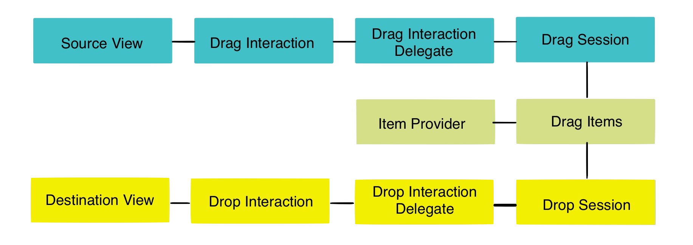

# [fit] A __“fun”__
# [fit] iOS 11
# [fit] workshop

---

# [fit] A __“fun”__ iOS 11 workshop
# [fit] __—__
# [fit] Xcode __9 beta 5__
# [fit] `github.com/sammyd/360iDev_iOS11`

---


---


# [fit] my
# [fit] name
# [fit] is
# [fit] __sam__

---


# [fit] github.com/__sammyd__
# [fit] @iwantmyrealname
# [fit] iwantmyreal.name
---


# [fit] razeware
# [fit] __raywenderlich.com__

---


# [fit] __buy__
# [fit] this
# [fit] book

---

# [fit] iOS __11__

---

# [fit] quite a
# [fit] __lot__ of
# [fit] __new__ stuff

---

# [fit] today...

---

# [fit] we look at
# [fit] __three__

---

# [fit] __1__
# [fit] first

---

# [fit] serialisation
# [fit] _with_
# [fit] __`Codable`__

---

# [fit] __2__
# [fit] second

---

# [fit] drag
# [fit] _**‘n’**_
# [fit] drop

---

# [fit] __3__
# [fit] third

---

# [fit] __natural__
# [fit] language
# [fit] processing

---

# [fit] __`Codable`__

---

> Make your data types encodable and decodable for compatibility with external representations such as JSON.
-- developer.apple.com


---

# [fit] __Many__ languages
# [fit] use __reflection__


---

# [fit] Swift 4 uses
# [fit] __code__
# [fit] __generation__

---
# [fit] Declare protocol conformance

```swift
struct MyStruct : Encodable, Decodable {
  let name: String
  let age: Int
  let lastLoggedIn: Date
}
```

---
# [fit] Declare protocol conformance

```swift
struct MyStruct : Codable {
  let name: String
  let age: Int
  let lastLoggedIn: Date
}
```

---

# [fit] let’s visit the
# [fit] __playground__

---

---

# [fit] drag
# [fit] _**‘n’**_
# [fit] drop

---



---

# [fit] __collection__
# [fit] and __table__
# [fit] views have DnD
# [fit] __built in__

---

# [fit] BugRay

---


# [fit] credits go to
# [fit] __Mic Pringle__
# [fit] @micpringle

---


---

# [fit] __N__atural
# [fit] __L__anguage
# [fit] __P__rocessing

---

# [fit] `NS`
# [fit] `Linguistic`
# [fit] `Tagger`

---

# [fit] Core ML

---


---

# [fit] Swift 4
# [fit] __`Codable`__

---

# [fit] Drag ‘n’ Drop
# [fit] __intra-app__
# [fit] __inter-app__

---

# [fit] NLP
# [fit] __Linguistic Tagger__
# [fit] __Core ML__

---

# [fit] There's
# [fit] __lot’s__
# [fit] more

---


# [fit] __buy__
# [fit] this
# [fit] book

---

# [fit] `github.com/sammyd`
# [fit] `/`__`360iDev_iOS11`__
# [fit] —
# [fit] __@iwantmyrealname__
# [fit] iwantmyreal.name


